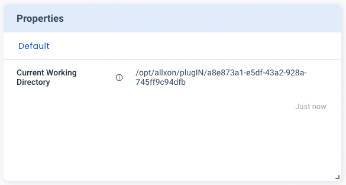

import Tabs from '@theme/Tabs';
import TabItem from '@theme/TabItem';

Plugin creation is made easy with [Hello Plugin](https://github.com/allxon/plugIN-hello) — you can modify and create a plugin from this plugin package without having to develop a new one from scratch.


```
git clone --recurse-submodules https://github.com/allxon/plugIN-hello.git
```

## Apply for a Plugin Credential

To get started, [contact us](https://www.allxon.com/contact-allxon-octo) to apply for a `plugin_credential.json` file. Your data is signed and safe with such plugin identity, and Allxon Portal can recognize your plugin for data transmission

Here is an example of `plugin_credential.json`:

```json
{
    "app_guid":"a5nf65b-1cf7-46e6-af56-d41eac4nbcC1",
    "access_key":"91IXqwIQkWItqmRJfNyZUTOwAc43smQP",
    "platform":"linux",
    "architecture":"x86_64"
}
```

The `app_guid` repesent your Plugin's ID. The  `access_key` is your key to sign your data.

:::caution
Please keep your `access_key` safe.  Don't reveal it to anyone.
:::

## Get the Plugin Online

First, you need to get your plugin online by connecting to WebSocket server. 

Below is the source code. 

`"wss://127.0.0.1:55688"`

```cpp {19} title="src/main.cpp"
// ...
int main(int argc, char **argv)
{
    if (argc == 1)
    {
        std::cout << "Please provide a plugin install directory." << std::endl;
        return 1;
    }
    else if (argc > 2)
    {
        std::cout << "Wrong arguments. Usage: device_plugin [plugin install directory]" << std::endl;
        return 1;
    }
    Util::plugin_install_dir = std::string(argv[1]);
    auto np_update_json = Util::getJsonFromFile(Util::plugin_install_dir + "/plugin_update_template.json");
    auto json_validator = std::make_shared<JsonValidator>(PLUGIN_NAME, PLUGIN_APP_GUID,
                                                          PLUGIN_ACCESS_KEY, PLUGIN_VERSION,
                                                          np_update_json);
    WebSocketClient web_client(json_validator, "wss://127.0.0.1:55688");
    web_client.RunSendingLoop();
    return 0;
}
```

:::info

Allxon Octo SDK only provides JSON encryption and decryption functionalities. Since it is not limited to specific WebSocket libraries, use whichever WebSocket library that suits your needs.
:::

Next, Send a `v2/notifyPluginUpdate` initialize all the cards on Allxon Portal.


Check line 5. Load a `v2/notifyPluginUpdate` API payload from `plugin_update_template.json`, which is located at `resource_dir_linux/plugin_update_template.json`. Then sign the JSON (line 18) and send it to Allxon Agent (line 23).


```cpp {5,18,23} title="src/websocket_client.cpp" showLineNumbers
// ...
void WebSocketClient::SendNotifyPluginUpdate()
{
    std::cout << "SendNotifyPluginUpdate" << std::endl;
    std::string notify_plugin_update = Util::getJsonFromFile(Util::plugin_install_dir + "/plugin_update_template.json");
    auto np_update_cjson = cJSON_Parse(notify_plugin_update.c_str());
    auto params_cjson = cJSON_GetObjectItemCaseSensitive(np_update_cjson, "params");
    auto modules_cjson = cJSON_GetObjectItemCaseSensitive(params_cjson, "modules");
    auto module_cjson = cJSON_GetArrayItem(modules_cjson, 0);
    auto properties_cjson = cJSON_GetObjectItemCaseSensitive(module_cjson, "properties");
    auto property_cjson = cJSON_GetArrayItem(properties_cjson, 0);
    auto property_value_cjson = cJSON_GetObjectItemCaseSensitive(property_cjson, "value");
    cJSON_SetValuestring(property_value_cjson, Util::plugin_install_dir.c_str());
    auto output_char = cJSON_Print(np_update_cjson);
    std::string output_string(output_char);
    delete output_char;
    cJSON_Delete(np_update_cjson);
    if (!m_json_validator->Sign(output_string))
    {
        std::cout << m_json_validator->error_message().c_str() << std::endl;
        return;
    }
    m_endpoint.send(m_hdl, output_string.c_str(), websocketpp::frame::opcode::TEXT);
    std::cout << "Send:" << output_string << std::endl;
}

// ...
```

## Build the Plugin

Put your **Plugin Credential** under your plugin working directory, and name the file `plugin_credential.json`.

<Tabs>
<TabItem value="bash" label="Linux">

```bash
# Configuration Stage
cmake -S . -B build -DCMAKE_BUILD_TYPE=<Debug|Release> -DPLUGIN_KEY=plugin_credential.json

# Build Stage
cmake --build build

# Run after build
# You can run plugin-hello directly under the build/ folder, and pass resource_dir_linux through argument
build/plugin-hello resource_dir_linux
```

</TabItem>
<TabItem value="cmd" label="Windows">

```batch
@REM Configuration Stage
cmake -G "Visual Studio 16 2019" -A Win32 -S . -B "build" -DPLUGIN_KEY=plugin_credential.json

@REM Build Stage
cmake --build build --config <Debug|Release>

@REM Run after build
@REM You can run plugin-hello directly under the build\ folder, and pass resource_dir_windows through argument
build\<Debug|Release>\plugin-hello.exe resource_dir_windows
```
</TabItem>
</Tabs>

## Run the Plugin

<Tabs>
<TabItem value="bash" label="Linux">

You can run **plugin-hello** directly under the `build/folder`, and pass `resource_dir_linux` through argument.

```bash
build/plugin-hello resource_dir_linux
```

</TabItem>
<TabItem value="cmd" label="Windows">

You can run **plugin-hello** directly under the `build\folder`, and pass `resource_dir_windows` through argument

```batch
build\<Debug|Release>\plugin-hello.exe resource_dir_windows
```
</TabItem>
</Tabs>

Then, you can find your Plugin page on Allxon Portal, displaying cards of **Commands**, **States**, **Properties**, and **Alert Settings**.


## About `v2/notifyPluginUpdate` API

`"method"` indicates the API's type and  `"params"` → `"sdk"`  indicates the  Allxon Octo SDK version. Each JSON object under `"params"` → `"modules"` corresponds to a different card on Allxon Portal.

Here is an example of JSON:

```json {16-24} title="resource_dir_linux/plugin_update_template.json" showLineNumbers
{
  "jsonrpc": "2.0",
  "method": "v2/notifyPluginUpdate",
  "params": {
    "sdk": "${OCTO_SDK_VERSION}",
    "appGUID": "${PLUGIN_APP_GUID}",
    "appName": "${PLUGIN_NAME}",
    "epoch": "",
    "displayName": "plugIN Hello",
    "type": "ib",
    "version": "${PLUGIN_VERSION}",
    "modules": [
      {
        "moduleName": "${PLUGIN_NAME}",
        "displayName": "plugIN Hello",
        "properties": [
          {
            "name": "current_dir",
            "displayName": "Current Working Directory",
            "description": "Print the current working directory",
            "displayType": "string",
            "value": ""
          }
        ],
        "states": [
          {
            "name": "receive_hello",
            "displayName": "Last Received Message",
            "description": "Last received message from a stranger",
            "displayType": "string"
          }
        ],
        "commands": [
          {
            "name": "say_hello",
            "type": "asynchronous",
            "displayCategory": "Action",
            "displayName": "Say Hello",
            "description": "Say hello to a person",
            "params": [
              {
                "name": "person",
                "displayName": "Person Name",
                "description": "Person who you wanna to say hello",
                "displayType": "string",
                "required": true,
                "defaultValue": "Buzz"
              }
            ]
          }
        ],
        "metrics": [],
        "events": [],
        "alarms": [
          {
            "name": "hello_alarm",
            "displayCategory": "Message",
            "displayName": "Hello alarm",
            "description": "Trigger when someone say hello",
            "params": []
          }
        ],
        "configs": []
      }
    ]
  }
}
```

The above highlighted section corresponds to the Properties card on Allxon Portal:



:::tip
You can use the built-in macro syntax  `${}` to obtain project level information. The current available syntax is as follows: `PLUGIN_NAME`, `PLUGIN_APP_GUID`, `PLUGIN_VERSION` and `OCTO_SDK_VERSION`.
:::
