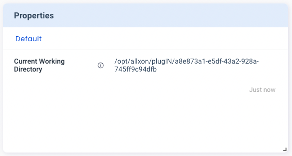
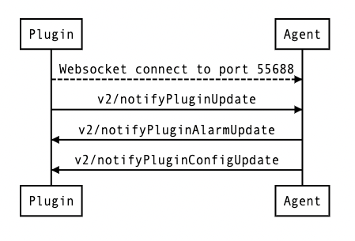

# API Overview

Allxon Octo API adopts [JSON-RPC 2.0](https://www.jsonrpc.org/specification) specification over WebSocket. To communicate with Allxon Agent, you need to create a WebSocket connection **wss://localhost:55688** from the plugin. Then send/receive requests in the JSON format via the API.

:::note

Each API maximum payload size is _128 KB_.

:::

:::note

Not support _JSON-RPC batch_.

:::

## About `v2/notifyPluginUpdate` API

`"method"` indicates the API's type and  `"params"` → `"sdk"`  indicates the  Allxon Octo SDK version. Each JSON object under `"params"` → `"modules"` corresponds to a different card on Allxon Portal.

Here is an example of JSON:

```json {16-24} title="resource_dir_linux/plugin_update_template.json" showLineNumbers
{
  "jsonrpc": "2.0",
  "method": "v2/notifyPluginUpdate",
  "params": {
    "sdk": "${OCTO_SDK_VERSION}",
    "appGUID": "${PLUGIN_APP_GUID}",
    "appName": "${PLUGIN_NAME}",
    "epoch": "",
    "displayName": "plugIN Hello",
    "type": "ib",
    "version": "${PLUGIN_VERSION}",
    "modules": [
      {
        "moduleName": "${PLUGIN_NAME}",
        "displayName": "plugIN Hello",
        "properties": [
          {
            "name": "current_dir",
            "displayName": "Current Working Directory",
            "description": "Print the current working directory",
            "displayType": "string",
            "value": ""
          }
        ],
        "states": [
          {
            "name": "receive_hello",
            "displayName": "Last Received Message",
            "description": "Last received message from a stranger",
            "displayType": "string"
          }
        ],
        "commands": [
          {
            "name": "say_hello",
            "type": "asynchronous",
            "displayCategory": "Action",
            "displayName": "Say Hello",
            "description": "Say hello to a person",
            "params": [
              {
                "name": "person",
                "displayName": "Person Name",
                "description": "Person who you wanna to say hello",
                "displayType": "string",
                "required": true,
                "defaultValue": "Buzz"
              }
            ]
          }
        ],
        "metrics": [],
        "events": [],
        "alarms": [
          {
            "name": "hello_alarm",
            "displayCategory": "Message",
            "displayName": "Hello alarm",
            "description": "Trigger when someone say hello",
            "params": []
          }
        ],
        "configs": []
      }
    ]
  }
}
```

The above highlighted section corresponds to the Properties card on Allxon Portal:


:::tip
You can use the built-in macro syntax  `${}` to obtain project level information. The current available syntax is as follows: `PLUGIN_NAME`, `PLUGIN_APP_GUID`, `PLUGIN_VERSION` and `OCTO_SDK_VERSION`.
:::


## Allxon Octo JSON RPC API

After getting online to Allxon Portal, your edge device is ready to be managed on the cloud. 
Here is a brief introduction to the API functionalities:


### `v2/notifyPluginUpdate`

| Direction | Description |
| --- | --- |
| Plugin → Allxon Agent | The plugin initializes every card on Allxon Portal. You must call  `v2/notifyPluginUpdate` API after the WebSocket connection is established.|

### `v2/notifyPluginCommand`

| Direction | Description |
| --- | --- |
| Allxon Agent → Plugin | The plugin gets notified once the user triggers the command on Allxon Portal. |

### `v2/notifyPluginCommandAck`

| Direction | Description |
| --- | --- |
| Plugin → Allxon Agent | After receiving `v2/notifyPluginCommand`, the plugin sends acknowledgement of the command back to Allxon Portal. | 
    
### `v2/notifyPluginState`

| Direction | Description |
| --- | --- |
| Plugin → Allxon Agent | The plugin updates the data the **States** card on the Allxon Portal States card. This functionality is typically designed for updating the current device states, e.g. network condition and power status. Allxon Portal only shows the latest data it receives and doesn’t reserve such data. | 
    
### `v2/notifyPluginEvent`

| Direction | Description |
| --- | --- |
| Plugin → Allxon Agent | The plugin updates the data on the **Event** card on Allxon Portal. The event types and triggers are predefined by the plugin. This functionality is typically used for device event updates, e.g. IO trigger event and user login event. Such data is reserved on Allxon Cloud for 90 days. | 
    
### `v2/notifyPluginMetric`

| Direction | Description |
| --- | --- |
| Plugin → Allxon Agent | The plugin updates data on the **Charts** card on the Portal. This functionality is typically designed for time-series data presented in a trend chart, e.g. device temperature. Such data is reserved on Allxon Cloud for 90 days.| 
    
### `v2/notifyPluginAlert`

| Direction | Description |
| --- | --- |
| Plugin → Allxon Agent | **Alerts** are predefined by the plugin. This functionality is typically designed for triggering Alerts configured on Allxon Portal and for pushing notifications to users by email, Webhook, LINE, etc.| 

### `v2/notifyPluginAlarmUpdate`

| Direction | Description |
| --- | --- |
| Allxon Agent → Plugin | When Alerts are set up on Allxon Portal, the plugin receives `v2/notifyPluginAlarmUpdate` to synchronize with the alert related settings. | 

### `v2/notifyPluginConfigUpdate`

| Direction | Description |
| --- | --- |
| Allxon Agent → Plugin | If Configs is set up on Allxon Portal, the plugin gets notified once it comes online.  This functionality is typically designed for setting rules to automate device operations. |

:::tip
For more details, please refer to the API Reference.
:::


## API Sequence Flow

Here is an example of the API sequence flow:



1. Connect to Allxon Agent by Websocket.
2. Send `v2/notifyPluginUpdate` to initialize cards on Allxon Portal.
3. Once the **Alert Settings** are updated, the plugin receives `v2/notifyPluginAlarmUpdate` to apply the settings.
4. Once **Configs** are set up on Allxon Portal, the plugin receives `v2/notifyPluginConfigUpdate` to apply the settings.
